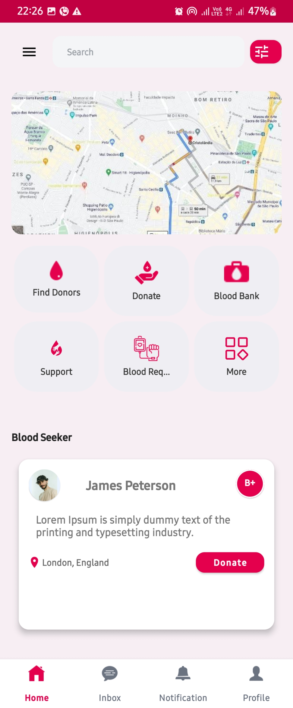

# 🩸 RedFlow - Blood Donation App

RedFlow is a mobile application designed to simplify the blood donation process by directly connecting donors and recipients.  
It addresses one of the most urgent healthcare challenges — locating compatible blood quickly in case of an emergency.  

With real-time data, geolocation, and a user-friendly design, RedFlow makes blood donor management efficient while encouraging voluntary donations.

---

## 🚀 Key Features
- 🔍 **Donor Discovery by Blood Type** – Find the right donors for specific blood groups.  
- ⏱️ **Real-Time Donor Availability** – See who is ready to donate nearby.  
- 🗺️ **Geolocation-Based Mapping** – Identify and contact donors in your area instantly.  
- 💬 **Secure Communication** – Built-in chat system for donor-recipient interaction.  
- 🔔 **Notifications** – Alerts for urgent donations, matches, and health tips.  
- 👤 **User Profiles & Tracking** – Track donations, requests, and impact.  

---

## 📱 App Screenshots
### Home Screen

### Inbox Screen

### Notification Screen

### Onboard Screen 1

### Onboard Screen 2

### Onboard Screen 3

### Profile Screen

### Sign In Page

### Sign Up Page

### Welcome Page

