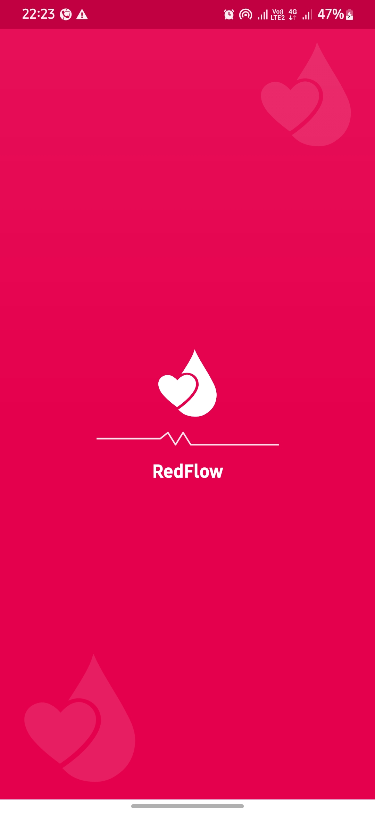

# 🩸 RedFlow - Blood Donation App

RedFlow connects donors and recipients directly to speed up life‑saving blood donations.  
Built with real‑time data, geolocation, and a clean, human‑centered UI.

## 🚀 Key Features
- **Donor Discovery by Blood Type**
- **Real‑Time Donor Availability**
- **Geolocation Mapping**
- **Secure Communication**
- **Smart Notifications**
- **Profiles & Activity Tracking**

## 📱 App Screenshots

  
  

  
  

  
  
  

  
  

  
  

